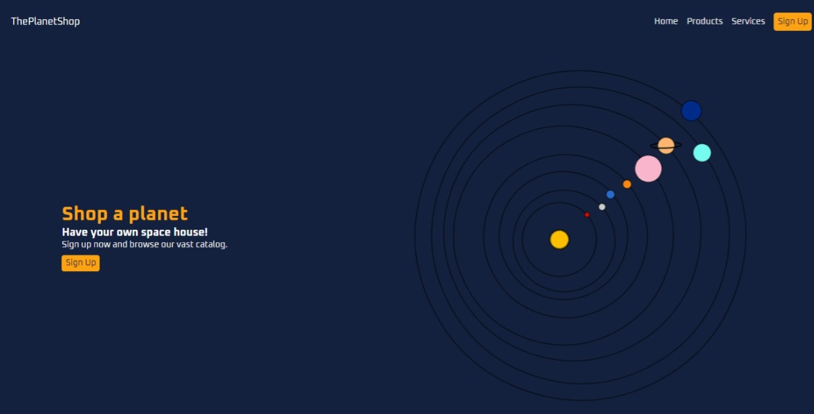

# The Planet Shop

This project is based on a tutorial found on Youtube - credits are given below.
It is a landing page build with HTML and Sass for a fictional company, "ThePlanetShop", that specializes in selling planets.

### Live site

- Live Site URL: [GitHub Page](https://ax-cd.github.io/planet-shop/)

## Description

The point of focus when I took this project was to get use to writing SASS, mainly organizing and linking the files so the entire project would work. The feature I like most is the animation I implemented for the image.

The project was built with:

- Semantic HTML5 markup
- SASS
- CSS Grid

And tested with:

- The Colour Contrast Analyser (CCA)
- The web accessibility evaluation tool (WAVE)
- The Markup Validation Service of W3C

### Screenshot

## Links

- Frontend Mentor - [@Ax-cd](https://www.frontendmentor.io/profile/Ax-cd)
- Instagram - [@ax.coding](https://www.instagram.com/ax.coding/)

## Credits

- The tutorial - ["Build a Responsive Website Using HTML & SASS/SCSS Tutorial" on YouTube by Brian Design](https://youtu.be/pk-MEjUINjI)
  The steps are clear and well explained.
